# Java Notes 

# History of Java
Java is compiled and interpreted language. Java was introduced in 1990 by Sun Microsystems, led by James Gosling.
Official development was released in 1995.  
purpose : made for IOT Devices

Benefits of Java
1) High Security
2) stability
3) Perfomance

👉 90% of Fortune 500 companies use Java for their backend development.

# Java is Still the Best Choice For:
1) Android Development
2) Banking and Fintech Applications
3) Big Data (Hadoop is Java-based)
4) Game Development (e.g., Minecraft uses Java)

# Why We Learn Java
1) Secure and Scalable
2) Modern Tech Stack → Kafka, Docker, Spring Boot, AWS, Kubernetes (k8s), etc.
3) Easy to Learn
4) Powers Backend Systems → 90%–95%

# java code Structure

class Main {
    public static void main(String[] args) {
        System.out.println("Hello World");
    }
}

# How to run Java Code
1) Javac filename.java
2) java filename hit enter

Example
javac Main.java
java Main

          ┌──────────────────────┐
          │  Your Source Code    │
          │  (Main.java)         │
          └────────┬─────────────┘
                   │
                   │ Compile using:
                   │   javac Main.java
                   ▼
          ┌──────────────────────┐
          │  Bytecode Generated  │
          │  (Main.class)        │
          └────────┬─────────────┘
                   │
                   │ Run using:
                   │   java Main
                   ▼
          ┌──────────────────────┐
          │   JVM (Java Virtual  │
          │   Machine)           │
          └────────┬─────────────┘
                   │
                   ▼
          ┌──────────────────────┐
          │   Program Output     │
          │  "Hello World"       │
          └──────────────────────┘

# Difference between Java and other language
1) Other language is static programming language and Java is dynamic programming language
Explanation:
If any programming language allows memory allocation for primitive data types at compile time, this is called static time.
If any programming language allows memory allocation for primitive data types at runtime, not at compile time, then this language is called a dynamic programming language.

2) Pre-processor is required in c and c++ not in java
 1) #include<stdio.h>
    #include<math.h>
    If we want to use predefined functions in C and C++, we have to include the header file. 
    When we include a header file, the pre-processor will load the specified header file into memory.
    This type of loading happens at compilation time and is called static loading.

# If we want to use predefined libraries in Java, then we have to include the corresponding package.
Example:
import java.io.*;    // For input/output classes
import java.util.*;  // For utility classes like ArrayList, Scanner, etc.
import java.sql.*;   // For database connectivity

While executing a Java program, if the JVM encounters any class or interface from a specific package, it will load the required class or interface into memory at runtime. Loading libraries at runtime is called dynamic loading.

3) C and C++ are platform-dependent programming languages, but Java is platform-independent

Explanation:
Programs written in C or C++ need to be compiled separately for each operating system.
Java programs are compiled into bytecode, which can run on any platform using the JVM (Java Virtual Machine).

ByteCode vs Machine Code

1) Bytecode not readebale by human and Machine
it is Understandable by JVM only
In Machine Code Generated by Bytecode by the JVM (using JIT Compiler) Written in 1s and 0s
JIT[Just In Time compiler convert Bytcode to Machine code during runtime]

# What is JVM

JVM converts Java bytecode into machine code and runs it on your computer, making Java platform-independent.
Steps inside JVM:
Loads the .class file.
Verifies the bytecode (checks for security & correctness).
Allocates memory in Heap (objects) and Stack (methods & variables).
JIT (Just-In-Time) Compiler optimizes performance by converting bytecode into native machine code at runtime.

# What is JRE(Java Runtime Environment)

JRE = JVM + runtimelibrary
1) Provides all the necessary libraries and files required to run a Java program.
2) Does not provide compilation — it can only run already compiled .class (bytecode) files.

# What is JDK(Java Development Kit)
 JDK = JRE + Development Kit(javac,javadoc,jar)
 1) Needed to develop & run java programs
 2) Contains everything in JRE + Comiler,debugger

# What is JIT(Just In Time Compiler)
  Convert frequent used to bytecode into machine code

  NOTE: JVM read line by line (interprete) but if you repeat a task again and again ,JIT says,Bhai Main kar deta hu and main ise yaad rakh luga (cache) then if you call the same code (hotcode) again then JIT will if you machine code from cache

# Variables and Data Types 
A variable is a named memory location that stores a value. Every variable in Java has a type which determines what kind of data it can store.

Data types specify what kind of data a variable can hold. Java has two main categories of data types:
1) Primitive Data Types
2) Non-Primitive (Reference) Data Types

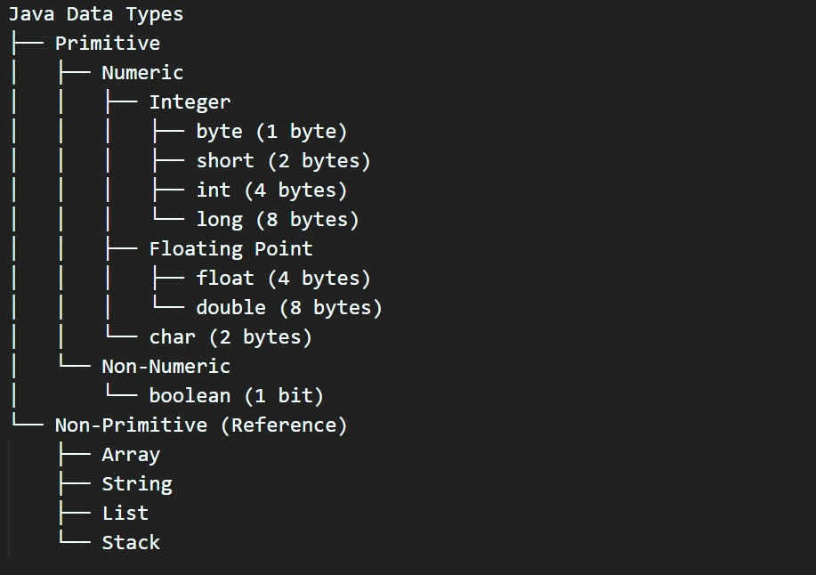

Identifier in Java = An identifier is the name given to classes, variables, methods, and interfaces.

*** Rules for Identfier ***
1) Valid characters:Letters (a–z, A–Z), digits (0–9), underscore _, dollar sign $
2) Start with: letter,_,$ [it cannot start with digit]
3) case sensitive: car, CAR, and CaR are all different identifiers
4) Reserved keyword:(int,for,while)

Examples:
*** integer types ***
byte age = 24;     age is (variable) it is identifier which hold 24 and data types is byte
short year = 2020;
int sal = 40000;
long req = 43495743934L;

*** floating types ***
float payment = 454.89f;
double bigPay = 434343.554;

*** char types ***
char grade = 'A';
boolean flag = true;  default value is false

# Operators
It is a symbol which tells compiler to perfom some operation/task.

Types of Operators
1) Arthimatic operators        +,*,-,/,%
2) Relation operators          == ,<,>,<= , >=,!=
3) Logical operators           &&,||,!
4) Assignment operators        =,+=,-=,*=,/=
5) Unary Operators             ++,--
6) Ternary operators           (a>b) ? a:b

# Control Statements
These are used to control program flow

1) if statements 
simple if
if-else
nested-if
if-else-if

2) iterative statements
while
do-while
for
for-each

3) Jump statements
break
continue
return

4) switch statemets

# How to taken input from User

use Scanner class to take input
first we want to import scanner class from java
import java.util.Scanner;
Syntax: Scanner sc =  new Scanner(System.in) // this will give you object
        int x = sc.nextInt();

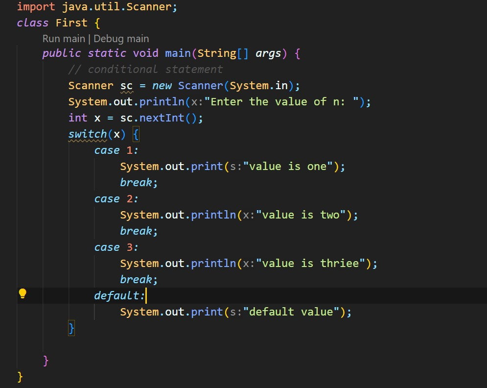

# Types of Variables
  Java has 3 types of Scope

  1) Instance
        clss ke ander or method k bhar use kar sakte hai Global variable ki tarah
  2) Local
        method k ander not method outside
  3) Static
        In static area only static variable will be used, static variable can be used
        in instance or local area
  Note: if we want to use instance variable inside static block area we have to use  object

  Note: if we want to access static instance variable in static area then no need to create object also we have call using classname

  Note: For static Instance variable only single will shared across the object, if we change in one place then change will reflect in all object because of single copy

    Example: 
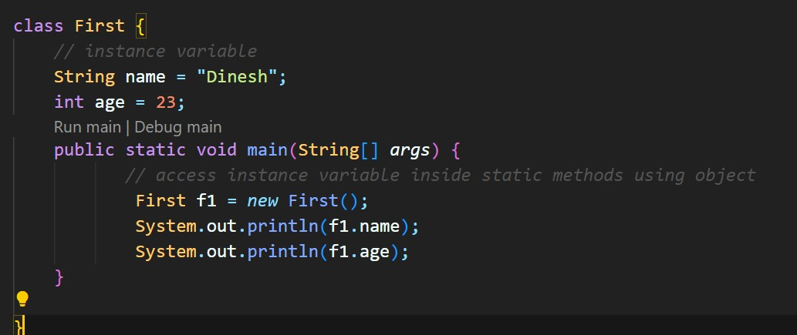

# Types of Methods in Java

1) No parameters and no return 
2) With parameters , no return
3) NO parameters ,return something
4) With Parameters , with return 

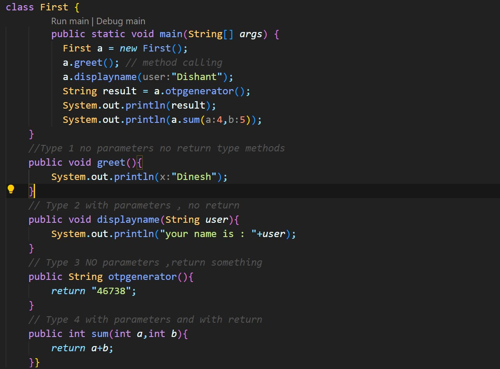

# Array in Java

Collection of similar Elements is known as Array

Syntax : int[] num = new int[4];
        String[] str = new String[3];

# Classe and Object in Java (Oops Concept)

Oops => OOPs is computer programming model that organizes software around
data or object rather then function and logic.

*** Class and object ***
A class is a blueprint or template for creating objects.
In Java, an object is a real-world entity or an instance of a class.
Example:

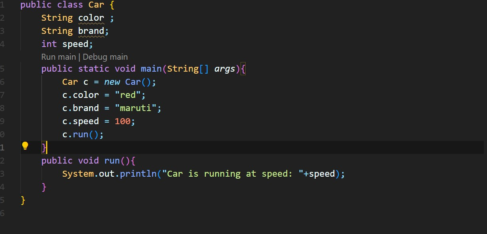

*** Constructor in Java ***

Constructor is a special method in java used to create and initialize objects

Rules of constructor

1) Has same name as class
2) No return type
3) Called by jvm automatically
4) Setting default values of instance variable and creating object

*** Types of constructor ***
1) Default Constructor
2) parametric Constructor
3) Overloaded Constructor

Note : if we are not creating any constructor then java creates default constructor
if we create parametric constructor then jvm does not make Default constructor

*** When we use para constructor ***
1) When we want to restrict object creation based on parameter
2) To set instance variable value at time of object creation

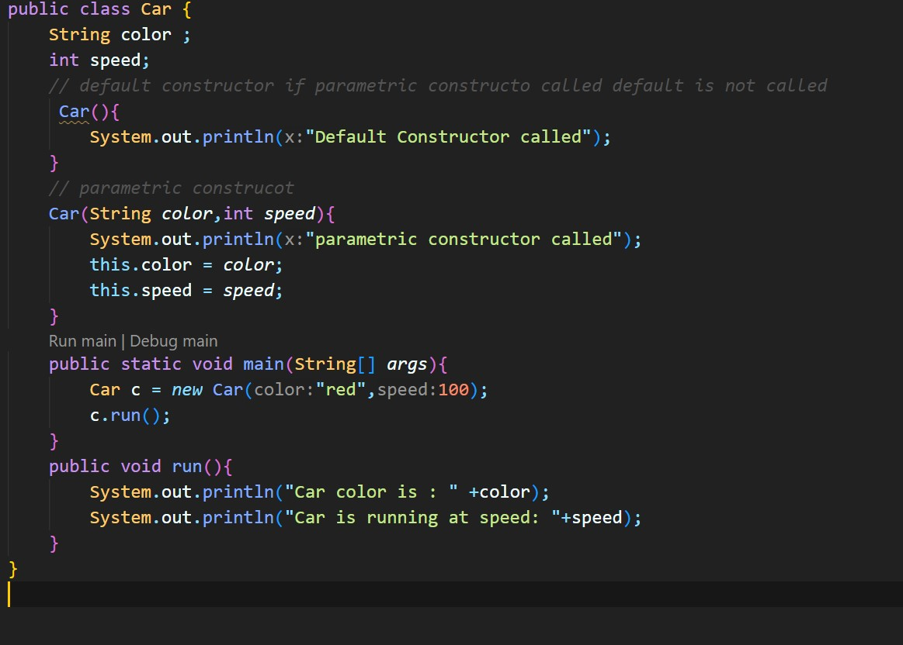

*** What is this ***
It is the keyword which refer to the current object

Why we use it => Refrence to current object or call current class constructor

*** Four Pilers of Oops *** 

1) Encapsulation

Encapsulation means binding data and methods together into a single unit (class) and restricting direct access to the data.

2) Inheritance

Inheritance allows one class to inherit the properties and methods of another class.
It promotes code reusability.

3) Polymorphism

Polymorphism means “many forms” — the ability of an object to behave in multiple ways.
It allows the same method name to perform different tasks depending on the context.

4) Abstraction

Abstraction means hiding internal details and showing only the essential features to the user.

# Types of Inheritance

1) Single Inheritance

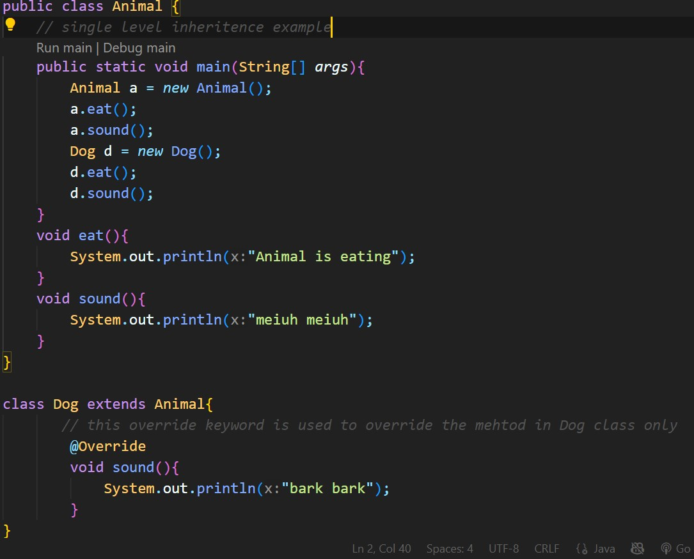

2) Multilevel Inheritance -> child ->parent->grandparent

super is a reference variable in Java that refers to the immediate parent class object.
We use it to:
1) Call parent class methods
2) Access parent class variables
3) Call parent class constructors

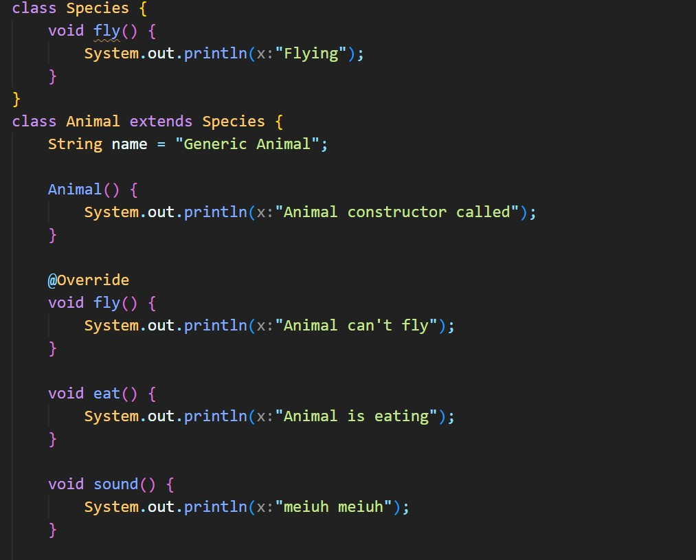
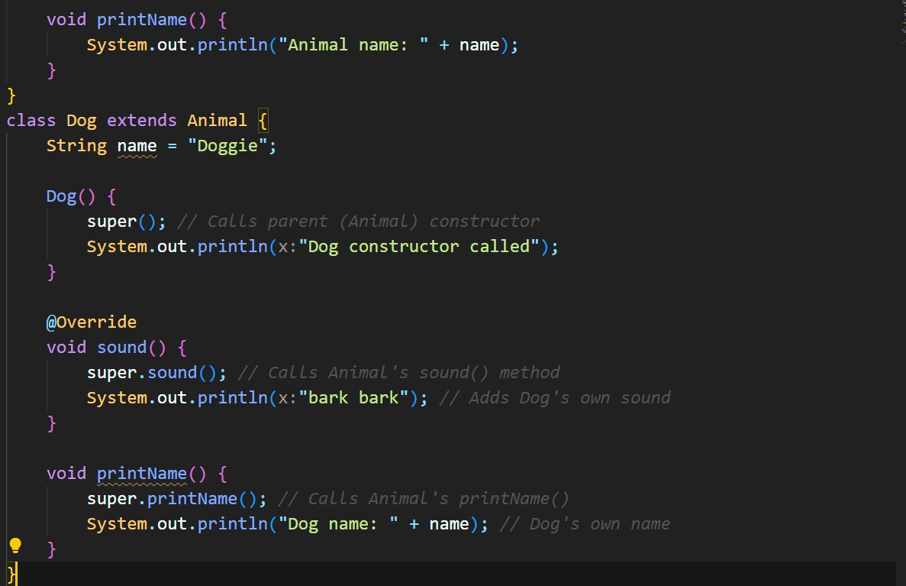
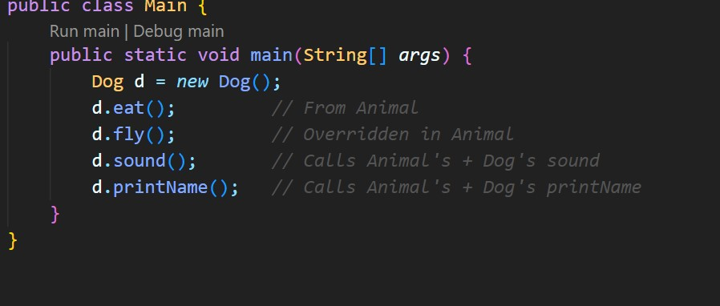

*** Method Overloading ****

What is Method Overloading?
Method Overloading in Java means having multiple methods in the same class with the same name but different parameters.

1) Return type can be same or different
2) Parameter list must differ (number or type of parameters)
3) Compile-time polymorphism (decided at compile time)

What is Method Overriding
Method Overriding Means change Parent implemented rules

1) Method name must be same
2) List of para must be same
3) Return type must be same
4) Private,final,static methods cannot be override
5) There must be IS-A relationship between classes (Inheritance)

# String in Java

A String in Java is an Class that represent sequence of characters

*** How to Create String object

1) Using Literal
   eg: String str = "dinesh"
2) Using new keyword
   eg: String name = new String("Dishant pandat")

<pre>

<code>

        String s1 = "Java";
        String s2 = "Java";
        String s3 = new String("Java");

                        ▼
         ┌──────────────────────────────┐
         │   String Constant Pool (SCP) │
         ├──────────────────────────────┤
         │   "Java"                     │
         └───────────┬──────────────────┘
                     │
           ┌─────────┴──────────┐
           │                    │
          s1                   s2
           │                    │
           ▼                    ▼
        (Refer same SCP object)

                        ▼
         ┌──────────────────────────────┐
         │         Heap Memory          │
         ├──────────────────────────────┤
         │   new String("Java")         │
         │   (New object created)       │
         └───────────┬──────────────────┘
                     │
                    s3
                     │
                     ▼
           (Points to new Heap object)

NOTE:  String is immutable we can't change after creation

1) StringBuffer -> mutable,Thread Safe,slow
2) StringBuilder -> mutalbe,Not Thread safe,fast
</code>
</pre>

Compression **************

1) String is immutable while Stringbuffer and StringBuilder are mutable
2) String and Stringbuffer Thread safe while StringBuilder are not Thread safe
3) String is medium , Stringbuffer are slow and stringBuilder are fast
4) String use password,connection Stringbuffer use logging, stringbuilder use frequent modification

# Exception Handling in Java (very Importent)

Defination: An Exception is runtime object representing a problem that interput the flow of you program.

An unwanted event that interrupt the flow of the program

<pres>
<code>

                      ┌─────────────────────────────┐
                      │          Object             │
                      └──────────────┬──────────────┘
                                     │
                      ┌───────────────┴───────────────┐
                      │          Throwable            │
                      └──────────────┬───────────────┘
                                     │
                ┌────────────────────┴────────────────────┐
                │                                         │
          ┌─────┴─────┐                           ┌────────┴────────┐
          │  Exception │                           │      Error      │
          └─────┬─────┘                           └──────────────────┘
                │
    ┌───────────┴────────────────────────┐
    │                                    │
┌────┴────┐                        ┌─────┴─────┐
│ Checked │                        │ Unchecked │
│Exception│                        │ Exception │
└────┬────┘                        └─────┬─────┘
     │                                   │
     ▼                                   ▼
 ┌───────────────┐               ┌────────────────────────┐
 │ IOException   │               │ NullPointerException   │
 │ SQLException  │               │ ArithmeticException    │
 │ FileNotFound  │               │ ArrayIndexOutOfBounds  │
 └───────────────┘               └────────────────────────┘

</code>
</pre>
Checked Exception --> these exception must by handle in try-catch or throw
Unchecked Exception --> these exception occur during Exceution

Note: Whether Exception is checked or unchecked compulsory it should occur at runtime only and there is no chance of occuring any exception at compile time.

Full checked vs partial checked
-------------------------------------

A checked exception is said to be fully checked if and only if it's child classes are also checked
Eg: IOException

A checked exception is said to be partially checked if and only if it's child classes are unchecked.

How to Handle Exception 
-------------------------
1) try-catch-finally
try:risky code will be place there
catch:handle exception
finally:Always executed

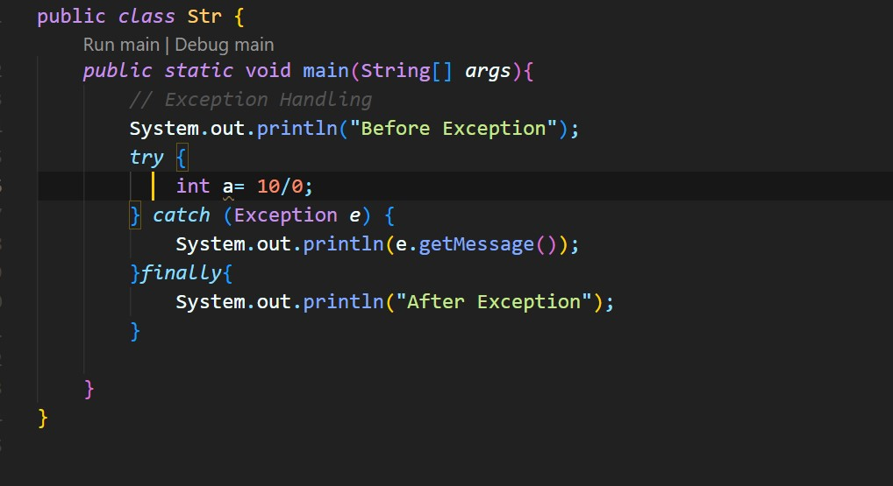

****** Throws *****
In java will use throws with method signature,when a method declare with throws keyword,
it means that the responsibility of handling exception is passed to the called method

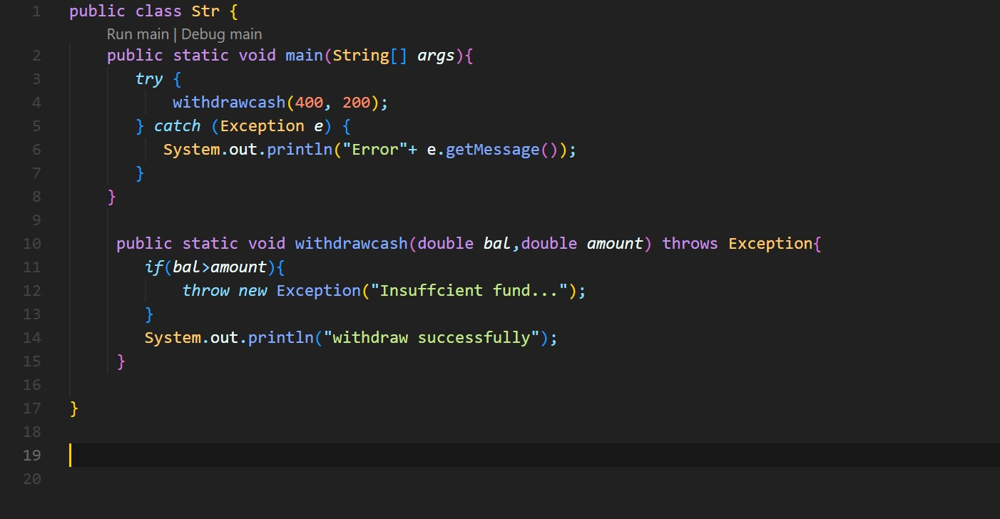

**** custome Excepiton ***** 
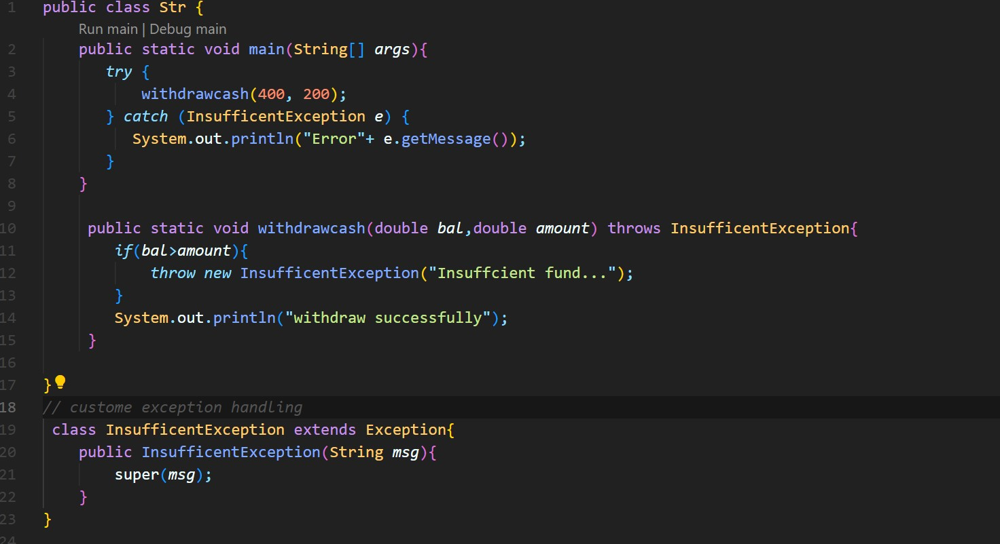

#Interface in Java

An interface in Java is a blueprint of a class.
It is used to achieve abstraction and multiple inheritance in Java.

<pre>
<code>

// Interface declaration
interface Animal {
    void eat();      // abstract method
    void sound();    // abstract method
}

// Implementing the interface
class Dog implements Animal {
    public void eat() {
        System.out.println("Dog eats bones");
    }

    public void sound() {
        System.out.println("Dog barks");
    }
}

// Another implementing class
class Cat implements Animal {
    public void eat() {
        System.out.println("Cat drinks milk");
    }

    public void sound() {
        System.out.println("Cat meows");
    }
}

// Main class to run the program
public class Main {
    public static void main(String[] args) {
        Animal a1 = new Dog(); // Reference of interface
        a1.eat();
        a1.sound();

        Animal a2 = new Cat();
        a2.eat();
        a2.sound();
    }
}

</code>
</pre>

# Multithreading in Java
Process of Creating multiple thread.
Multithreading means executing multiple thread simultaneously to achieve concurrent execution.
It help Max.CPU utilization,it is fast

What is Thread => Executing many task simultaneously where each task is seperated independent part of same program/process is called thread.it is a lightweight/ smallest uint of execution inside a process 

we have two options two create thred
-----------------------------------------
1) By executing Thread class
2) By Implementing Runnable class

Thread Seheduler
-----------------------------------------
When multiple thread are waiting for execution,the which thread will execute
first is decided by threadscheduler

TS have specific algoriham using it TS decide is it not standard process it depends on JVM to JVM
TS decide on the basis of priotiy and initialy priority of main thread is 4, so if we create any thread from main thread the priority will pass on.

Relation between Start() and run()
---------------------------------------

1) When we use start() method , a new thread will be created,and this method is responsible to call the run() method
2) when we use run() in place of start() then no new thread will be created

Thread Life Cyle
---------------------------------------

1) New → Thread is created but not yet started (new Thread()).
2) Runnable → After calling start(), thread is ready to run (may be waiting for CPU time).
3) Running → The thread is currently executing.
4) Blocked / Waiting / Timed Waiting → The thread is temporarily inactive.
5) Terminated (Dead) → The thread has finished execution.

Implement by Runnables implementd
------------------------------------------

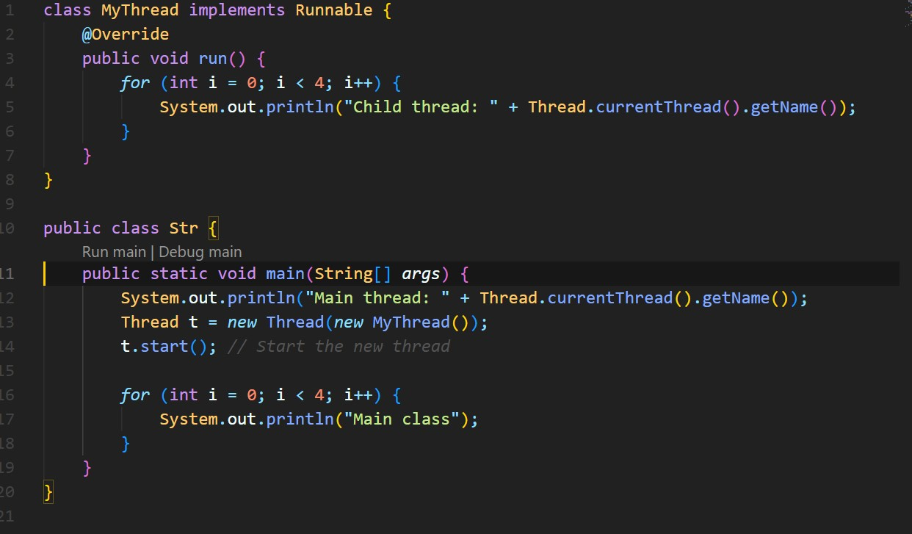

Methods to prevent thread execution
---------------------------------------------

1) Yield() -> i am willing to pause and give a chance to a thread of equal Priority
Note: it's not guaranteed - it is just a signal or command
2) Join() -> when one thread call join() on another ,i say i will wait until you are done.
3) Sleep() -> sleep method pause the current thread for a specific number of milliseconds.

Synchornization 
------------------------------

<pre>
<code>
class Count {
    private int count = 0;

    public synchronized void increment() {
        count++;
    }

    public int getCount() {
        return count;
    }
}

class MyThread extends Thread {
    private Count c;

    MyThread(Count c) {
        this.c = c;
    }

    @Override
    public void run() {
        for (int i = 0; i < 50; i++) {
            c.increment();
        }
    }
}

public class Str {
    public static void main(String[] args) {
        Count counter = new Count(); // ✅ One shared Count object

        MyThread t1 = new MyThread(counter);
        MyThread t2 = new MyThread(counter);

        t1.start();
        t2.start();

        try {
            t1.join();
            t2.join();
        } catch (InterruptedException e) {
            e.printStackTrace();
        }

        System.out.println("Final Count: " + counter.getCount());
    }
}
</code>
</pre>

Inter Thread Communication
--------------------------------------

1) wait(): this method I called on the object within a synchronized context/area to make the current wait untill another thread invokes notify or notifyAll.when thread call wait() it realese the lock on the object and enter into the waiting state.

2) Notify(): This is called on the object within synchronized context to wake up a waiting thread. when notify() is invoked it notifes on of the thread that are in waiting on the wake up.The choice of which thread to notify is not specifies and depend on the JVM.

3) NotifyAll(): This method is similar to notify(),but it wake up all thread that are waiting on the same object.

# 🧵 Java Thread Communication using `wait()` and `notify()`

This example demonstrates how the **main thread waits** for a **child thread** to finish its calculation using `wait()` and `notify()`.

<pre>
<code>
class MyThread extends Thread{

    int total = 0;

    @Override
    public void run(){
        synchronized (this) {
            System.out.println("Child thread starting calculation...");
            for(int i=0;i<100;i++){
                this.total += i;
            }
            this.notify();
            System.out.println("Child thread giving notification...");
        }
    }
}

public class Str {
    public static void main(String[] args) {
        try {
            MyThread t1 = new MyThread();
            t1.start();

            synchronized (t1) {
                System.out.println("Main thread waiting for child thread...");
                t1.wait();
            }

            System.out.println("Total is: " + t1.total);
        } catch (Exception e) {
            e.printStackTrace();
        }
    }
}
</code>
</pre>

# Abstract class & Interface
Abstract class ek aisi class hoti hai jiska object nahi banaya ja sakta
Lekin usse inherit (extend) karke dusri class bana sakte hain.

Code Examaple

<pre>
<code>
  abstract class BankAccount{

    String holderName;
    double balance; 

     BankAccount(String holderName,double balance) {
        this.holderName = holderName;
        this.balance = balance;
    }
    // Abstract method — must be implemented by child classes
    abstract void calclateInterest();
    
    public void deposti(int amount){
         balance+=amount;
    }
    void withdraw(int amount){
        if(amount<balance){
            balance-=amount;
             System.out.println(amount + " withdrawn. Remaining balance: " + balance);
        }else{
            System.out.println("Insufficient balance");
        }
    }
}

class A extends  BankAccount{

     A(String holderName,double amount) {
        super(holderName, amount);
    }
    @Override
    void calclateInterest(){
        double interest = balance * 0.04;
        balance+=interest;
        System.out.println("💰 Interest added: " + interest + ", Total balance: " + balance);
    }
    
}

class B extends BankAccount{
    B(String holderName,double amount){
        super(holderName,amount);
    }

    @Override
    void calclateInterest(){
        double interest = balance * 0.06;
        balance+=interest;
        System.out.println("💰 Interest added: " + interest + ", Total balance: " + balance);
    }
}

public class Str {
    public static void main(String[] args) {
        BankAccount b = new A("Dinesh",600);
        BankAccount c =  new B("Khushi",700);
        b.calclateInterest();
        c.calclateInterest();

    }
}
</code>
</pre>

Interface: in real world abstract is not much used, most of the time interface will be used
1) When you have 50% informaiton about the class actions then go for abstract class
2) Use interface when we don't have any info about the class and we want the child to implement and give implemented

<pre>
<code>
@FunctionalInterface
interface Calculator {
    int operate(int a, int b);

    // Default method
    default void show() {
        System.out.println("Performing operation...");
    }

    // Static method
    static void info() {
        System.out.println("This is a Calculator Functional Interface.");
    }
}

public class Main {
    public static void main(String[] args) {
        // Using lambda to define addition
        Calculator add = (a, b) -> a + b;

        add.show(); // default method call
        System.out.println("Sum: " + add.operate(10, 20));

        Calculator.info(); // static method call
    }
}

</code>
</pre>

# Collection in java
----------------------------------

In java collection is an object that group multiple element into single entity.
Eg:It is like container that hold multiple object into one place.
Before learning Collection you know about wrapper class

Wraper class in java are used to wrap primitive data types.

Wraper classes
1) byte -> Byte
2) short -> Short
3) int -> Integer
4) long -> Long
5) float -> Float
6) double -> Double
7) char -> Character
8) boolean -> Boolean

Why wraper class
----------------------
Note: Java was designed to be object-oriented,but primitive are not object so we can't perfom some operations so we need wrapper classes

eg.Wraper class

<pre>
<code>
class Collection{
    public static void main(String[] args) {
       Integer i = 100;
       Integer i2 = 100;
       // note it give true -128 to 127 cache mentain
       // if i >100 and i2 >100 then i gives false 
       System.out.println(i==i2);
        
    }
}
</code>
</pre>

Collection vs Collections
-------------------------
Collection ---> super interface for List,Set ,Queue
Collections --> utility/helper class with static method

Collection Hierarchy
-------------------------------

<pre>
<code>
                  Iterable (Interface)
                         │
                 ┌───────┴────────┐
                 │                │
              Collection       Map (Interface)
                 │
     ┌───────────┼────────────┐
     │           │            │
    List        Set         Queue
     │           │            │
     │           │        Deque (Interface)
     │           │            │
     │           │            │
ArrayList     HashSet      PriorityQueue
LinkedList    LinkedHashSet ArrayDeque
Vector        TreeSet
Stack
</code>
</pre>
Note:
List -> duplicate allowed,insertion orderis preserved,
set -> duplicate not allowed, insertion order not preserved
Hashset -> No duplicate random no order
LinkedHashset -> No duplicate , Maintain insertion order

Examples : ----->
1) ArrayList 
<pre>
<code>
import java.util.ArrayList;
import java.util.List;
class Collection{
    public static void main(String[] args) {
       List<Integer> nums = new ArrayList<>();
       nums.add(36);
       nums.add(27);
       nums.add(43);
       nums.add(46);
       nums.add(36);
       System.out.println(nums);
       System.out.println(nums.get(3));
       // some methods like size(),Add(),Remove(),clear(),isEmpty() etc;
    }
}
</code>
</pre>
Example stack:
<pre>
<code>
import java.util.Stack;
class Collection{
    public static void main(String[] args){
      Stack<Integer> st = new Stack<>();
      st.push(43);
      st.push(27);
      st.push(36);
      st.push(37);
      st.pop();
      System.out.println(st);    
    }
}
</code>
</pre>
Set Example:
-------------
no duplicate
order nahi hai
random access nahi hai
<pre>
<code>
import java.util.HashSet;
import java.util.Set;
class Collection{
    public static void main(String[] args){
       Set<Integer> st = new HashSet<>();
       st.add(3);
       st.add(4);
       st.add(3);
       st.add(40);
       st.add(49);
       System.out.println(st);
    }
}
</code>
</pre>

